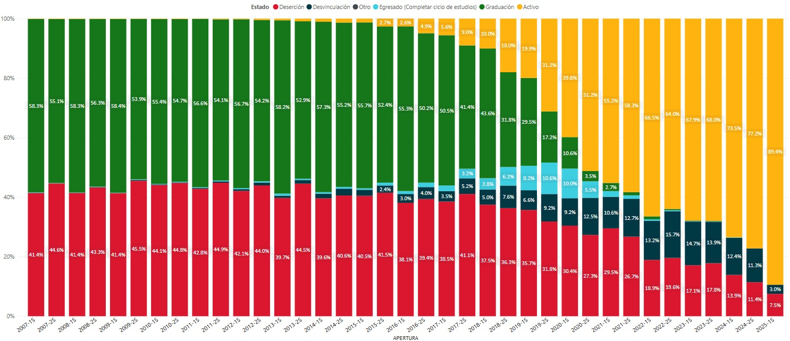
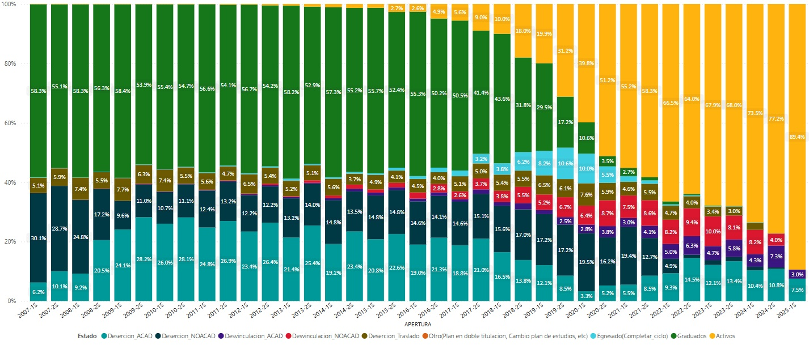

```{r}

# Librerías

library(tidyverse)
library(UnalData)
library(UnalR)
library(highcharter)

# Funcón color

color <- function(n_colores){
  salida <- colorRampPalette(c("#6495ED", "#8cc63f", "#FFD700", "#f15a24", "#DA70D6"))(n_colores)
  return(salida)
}

# Bases de datos

# Aspirantes a Pregrado
Aspirantes <- UnalData::Aspirantes %>% mutate(TOTAL = "Total")
AspirantesPre <- Aspirantes %>% filter(TIPO_NIVEL == "Pregrado", !is.na(TIPO_INS))

# Admitidos a Pregrado
AdmitidosPre <- AspirantesPre %>% filter(ADMITIDO == "Sí")

# Admitidos Pregrado 20261
AdmitidosPre261 <- AdmitidosPre %>% filter(YEAR == 2026, SEMESTRE == 1)

# Matriculados en Pregrado

source("scripts/Matricula 20261.R")

Matriculados <- UnalData::Matriculados %>%
  bind_rows(Matricula_20261) %>%
  mutate(TOTAL = "Total")

MatriculadosPre <- Matriculados %>% filter(TIPO_NIVEL == "Pregrado")
MatriculadosPre261 <- MatriculadosPre %>% filter(YEAR == 2026, SEMESTRE == 1)

# Matriculados Primera Vez en Pregrado

MatriculadosPVPre <- MatriculadosPre %>%
  filter(MAT_PVEZ == "Sí")
MatriculadosPVPre261 <- MatriculadosPVPre %>% filter(YEAR == 2026, SEMESTRE == 1)

# Graduados en Pregrado
Graduados <- UnalData::Graduados %>% mutate(TOTAL = "Total")
GraduadosPre <- Graduados %>% filter(TIPO_NIVEL == "Pregrado")
GraduadosPre252 <- GraduadosPre %>% filter(YEAR == 2025, SEMESTRE == 2)

# Cupos Pregrado

Cupos_Pre <- read_excel("Datos/Cupos_Pregrado.xlsx", guess_max = 5000)


# Histórico Programas Pregrado

Historico_Programas <- read_excel("Datos/Historico_Programas.xlsx", guess_max = 1000) %>% filter(TIPO_NIVEL_PRO == "Pregrado")

# Bases de poblaciones

# Serie General: Admitidos - Mat - Cupos - Graduados

Admitidos <- AdmitidosPre %>% filter(YEAR >= 2021) %>% summarise(Total = n(), .by = c(YEAR, SEMESTRE)) %>% mutate(Clase = "Admitidos") %>% relocate(Clase, .before = Total)
Mat_Pvez <- MatriculadosPVPre %>% filter(YEAR >= 2021) %>% summarise(Total = n(), .by = c(YEAR, SEMESTRE)) %>% mutate(Clase = "Matriculados primera vez") %>% relocate(Clase, .before = Total)
Graduados <-  GraduadosPre %>% filter(YEAR >= 2021) %>% summarise(Total = n(), .by = c(YEAR, SEMESTRE)) %>% mutate(Clase = "Graduados") %>% relocate(Clase, .before = Total)
Cupos <- Cupos_Pre %>% filter(YEAR >= 2021) %>% summarise(Total = sum(CUPOS), .by = c(YEAR, SEMESTRE)) %>% mutate(Clase = "Cupos") %>% relocate(Clase, .before = Total)
Poblaciones <- bind_rows(Cupos, Admitidos, Mat_Pvez, Graduados) %>% mutate(Variable = "POBLACION") %>% relocate(Variable, .before = YEAR)

# Poblaciones Sedes Por Programas Cód SNIES

Admitidos_Pro <- AdmitidosPre %>% left_join(Historico_Programas, by = "COD_PADRE") %>% filter(YEAR >= 2021) 
Mat_Pvez_Pro <- MatriculadosPVPre %>% left_join(Historico_Programas, by = "COD_PADRE") %>% filter(YEAR >= 2021) 
Graduados_Pro <- GraduadosPre %>% left_join(Historico_Programas, by = "COD_PADRE") %>% filter(YEAR >= 2021) 
Cupos_Pro <- Cupos_Pre %>% filter(YEAR >= 2021)


# Serie Adm - Mat p Vez - Grad - Cupos - SEDE BOGOTÁ

Admitidos_Pro_Bog <- Admitidos_Pro %>% filter(SEDE_PROG == "Bogotá") %>% summarise(Total = n(), .by = c(YEAR, SEMESTRE)) %>% mutate(Clase = "Admitidos") %>% relocate(Clase, .before = Total)
Mat_Pvez_Pro_Bog <- Mat_Pvez_Pro %>% filter(SEDE_PROG == "Bogotá") %>% summarise(Total = n(), .by = c(YEAR, SEMESTRE)) %>% mutate(Clase = "Matriculados primera vez") %>% relocate(Clase, .before = Total)
Graduados_Pro_Bog <- Graduados_Pro %>% filter(SEDE_PROG == "Bogotá") %>% summarise(Total = n(), .by = c(YEAR, SEMESTRE)) %>% mutate(Clase = "Graduados") %>% relocate(Clase, .before = Total)
Cupos_Pro_Bog <- Cupos_Pro %>% filter(SEDE_NOMBRE == "Bogotá") %>% summarise(Total = sum(CUPOS), .by = c(YEAR, SEMESTRE)) %>% mutate(Clase = "Cupos") %>% relocate(Clase, .before = Total)
Poblaciones_Bog <- bind_rows(Cupos_Pro_Bog, Admitidos_Pro_Bog, Mat_Pvez_Pro_Bog, Graduados_Pro_Bog) %>% mutate(Variable = "POBLACION") %>% relocate(Variable, .before = YEAR)


# Serie Adm - Mat p Vez - Grad - Cupos - SEDE MEDELLÍN

Admitidos_Pro_Med <- Admitidos_Pro %>% filter(SEDE_PROG == "Medellín") %>% summarise(Total = n(), .by = c(YEAR, SEMESTRE)) %>% mutate(Clase = "Admitidos") %>% relocate(Clase, .before = Total)
Mat_Pvez_Pro_Med <- Mat_Pvez_Pro %>% filter(SEDE_PROG == "Medellín") %>% summarise(Total = n(), .by = c(YEAR, SEMESTRE)) %>% mutate(Clase = "Matriculados primera vez") %>% relocate(Clase, .before = Total)
Graduados_Pro_Med <- Graduados_Pro %>% filter(SEDE_PROG == "Medellín") %>% summarise(Total = n(), .by = c(YEAR, SEMESTRE)) %>% mutate(Clase = "Graduados") %>% relocate(Clase, .before = Total)
Cupos_Pro_Med <- Cupos_Pro %>% filter(SEDE_NOMBRE == "Medellín") %>% summarise(Total = sum(CUPOS), .by = c(YEAR, SEMESTRE)) %>% mutate(Clase = "Cupos") %>% relocate(Clase, .before = Total)
Poblaciones_Med <- bind_rows(Cupos_Pro_Med, Admitidos_Pro_Med, Mat_Pvez_Pro_Med, Graduados_Pro_Med) %>% mutate(Variable = "POBLACION") %>% relocate(Variable, .before = YEAR)


# Serie Adm - Mat p Vez - Grad - Cupos - SEDE MANIZALES

Admitidos_Pro_Man <- Admitidos_Pro %>% filter(SEDE_PROG == "Manizales") %>% summarise(Total = n(), .by = c(YEAR, SEMESTRE)) %>% mutate(Clase = "Admitidos") %>% relocate(Clase, .before = Total)
Mat_Pvez_Pro_Man <- Mat_Pvez_Pro %>% filter(SEDE_PROG == "Manizales") %>% summarise(Total = n(), .by = c(YEAR, SEMESTRE)) %>% mutate(Clase = "Matriculados primera vez") %>% relocate(Clase, .before = Total)
Graduados_Pro_Man <- Graduados_Pro %>% filter(SEDE_PROG == "Manizales") %>% summarise(Total = n(), .by = c(YEAR, SEMESTRE)) %>% mutate(Clase = "Graduados") %>% relocate(Clase, .before = Total)
Cupos_Pro_Man <- Cupos_Pro %>% filter(SEDE_NOMBRE == "Manizales") %>% summarise(Total = sum(CUPOS), .by = c(YEAR, SEMESTRE)) %>% mutate(Clase = "Cupos") %>% relocate(Clase, .before = Total)
Poblaciones_Man <- bind_rows(Cupos_Pro_Man, Admitidos_Pro_Man, Mat_Pvez_Pro_Man, Graduados_Pro_Man) %>% mutate(Variable = "POBLACION") %>% relocate(Variable, .before = YEAR)

# Serie Adm - Mat p Vez - Grad - Cupos - SEDE PALMIRA

Admitidos_Pro_Pal <- Admitidos_Pro %>% filter(SEDE_PROG == "Palmira") %>% summarise(Total = n(), .by = c(YEAR, SEMESTRE)) %>% mutate(Clase = "Admitidos") %>% relocate(Clase, .before = Total)
Mat_Pvez_Pro_Pal <- Mat_Pvez_Pro %>% filter(SEDE_PROG == "Palmira") %>% summarise(Total = n(), .by = c(YEAR, SEMESTRE)) %>% mutate(Clase = "Matriculados primera vez") %>% relocate(Clase, .before = Total)
Graduados_Pro_Pal <- Graduados_Pro %>% filter(SEDE_PROG == "Palmira") %>% summarise(Total = n(), .by = c(YEAR, SEMESTRE)) %>% mutate(Clase = "Graduados") %>% relocate(Clase, .before = Total)
Cupos_Pro_Pal <- Cupos_Pro %>% filter(SEDE_NOMBRE == "Palmira") %>% summarise(Total = sum(CUPOS), .by = c(YEAR, SEMESTRE)) %>% mutate(Clase = "Cupos") %>% relocate(Clase, .before = Total)
Poblaciones_Pal <- bind_rows(Cupos_Pro_Pal, Admitidos_Pro_Pal, Mat_Pvez_Pro_Pal, Graduados_Pro_Pal) %>% mutate(Variable = "POBLACION") %>% relocate(Variable, .before = YEAR)


# Serie Adm - Mat p Vez - Grad - Cupos - SEDE DE LA PAZ

Admitidos_Pro_Paz <- Admitidos_Pro %>% filter(SEDE_PROG == "De La Paz") %>% summarise(Total = n(), .by = c(YEAR, SEMESTRE)) %>% mutate(Clase = "Admitidos") %>% relocate(Clase, .before = Total)
Mat_Pvez_Pro_Paz <- Mat_Pvez_Pro %>% filter(SEDE_PROG == "De La Paz") %>% summarise(Total = n(), .by = c(YEAR, SEMESTRE)) %>% mutate(Clase = "Matriculados primera vez") %>% relocate(Clase, .before = Total)
Graduados_Pro_Paz <- Graduados_Pro %>% filter(SEDE_PROG == "De La Paz") %>% summarise(Total = n(), .by = c(YEAR, SEMESTRE)) %>% mutate(Clase = "Graduados") %>% relocate(Clase, .before = Total)
Cupos_Pro_Paz <- Cupos_Pro %>% filter(SEDE_NOMBRE == "De La Paz") %>% summarise(Total = sum(CUPOS), .by = c(YEAR, SEMESTRE)) %>% mutate(Clase = "Cupos") %>% relocate(Clase, .before = Total)
Poblaciones_Paz <- bind_rows(Cupos_Pro_Paz, Admitidos_Pro_Paz, Mat_Pvez_Pro_Paz, Graduados_Pro_Paz) %>% mutate(Variable = "POBLACION") %>% relocate(Variable, .before = YEAR)


# Acumulado Matriculados primera vez por programas - 2021-2026

Acum_MatriculadosPVPre <-  MatriculadosPVPre %>% 
  filter(YEAR >= 2021) %>% 
  select(YEAR, SEMESTRE, MOD_ADM, TIPO_ADM, SEDE_NOMBRE_ADM, SEDE_NOMBRE_MAT, COD_PADRE) %>% 
  summarise(Matriculados = n(), .by = c(COD_PADRE)) 

# Acumulado Cupos por programas 2021-2026

Acum_Cupos <- Cupos_Pre %>% 
  filter(YEAR >= 2021) %>% 
  summarise(Cupos = sum(CUPOS), .by = c(COD_PADRE, SEDE_NOMBRE, NOMBRE_PROGRAMA))


# Consolidado Cupos y Mat Primera Vez por Programas

General_Cupos_MatPvez <- Acum_Cupos %>% left_join(Acum_MatriculadosPVPre, by = c("COD_PADRE")) %>% 
  rename(Sede = SEDE_NOMBRE,
         Programa = NOMBRE_PROGRAMA) %>% 
mutate(Ratio = Matriculados / Cupos)

# Bases Sedes

General_Cupos_MatPvez_Bog <- General_Cupos_MatPvez %>% filter(Sede == "Bogotá") %>%  mutate(Porcentaje = round(Ratio * 100, 1)) %>%  arrange(Porcentaje)
General_Cupos_MatPvez_Med <- General_Cupos_MatPvez %>% filter(Sede == "Medellín") %>%  mutate(Porcentaje = round(Ratio * 100, 1)) %>%  arrange(Porcentaje)
General_Cupos_MatPvez_Man <- General_Cupos_MatPvez %>% filter(Sede == "Manizales") %>%  mutate(Porcentaje = round(Ratio * 100, 1)) %>%  arrange(Porcentaje)
General_Cupos_MatPvez_Pal <- General_Cupos_MatPvez %>% filter(Sede == "Palmira") %>%  mutate(Porcentaje = round(Ratio * 100, 1)) %>%  arrange(Porcentaje)
General_Cupos_MatPvez_Paz <- General_Cupos_MatPvez %>% filter(Sede == "De La Paz") %>%  mutate(Porcentaje = round(Ratio * 100, 1)) %>%  arrange(Porcentaje)

```

## QR de la presentación

<br>

{fig-align="center" height="480"}

## Objetivo de la Presentación {.center}

<br>

Presentar las tendencias estadísticas de pregrado (periodos 2021-2026) en la UNAL a nivel de las poblaciones de aspirantes, admitidos, matriculados por primera vez y  graduados, así como cifras sobre la atracción de programas y las tasas de abandono, con el fin de que las comunidades académicas tengan elementos de juicio para el diseño de estrategias orientadas al aumento de la cobertura, la transformación curricular, el diseño y construcción de nuevos programas y el mejoramiento de las tasas de retención y de  graduación.


## Aspirantes a Pregrado {.center}

## Tendencias Aspirantes a Pregrado {.smaller}

::: panel-tabset

### Serie

```{r}
#| echo: FALSE

Agregar(TOTAL ~ YEAR + SEMESTRE,
                    frecuencia = list(c(2021:2026), c(1:2)),
                    intervalo = list(c(2021, 1), c(2026, 1)),
                    datos = AspirantesPre,
                    textNA = "Sin información") %>% filter(Clase == "Total") %>%
              Plot.Series(categoria = "TOTAL",
               colores = c("#8cc63f"), # verde, Total
               titulo = "Evolución histórica total de aspirantes a pregrado, periodo 2021-2026",
               labelY = "Número de aspirantes<br>",
               ylim = c(0,NaN),
               libreria = c("highcharter"),
               estilo = list(hc.Tema = 5))

```
<p style="font-size: 12px;">Fuente: Estadísticas oficiales DNPE</p>


### Sedes

```{r}
#| echo: FALSE

Agregar(INS_SEDE_NOMBRE ~ YEAR + SEMESTRE,
                  frecuencia = list(c(2021:2026), c(1:2)),
                    intervalo = list(c(2021, 1), c(2026, 1)),
                    datos = AspirantesPre,
                    textNA = "Sin información") %>%
           Plot.Series(categoria = "INS_SEDE_NOMBRE",
              titulo = "Evolución total de aspirantes a pregrado por sedes de inscripción, periodo 2021-2026",
              labelY = "Número de aspirantes<br>",
              colores = color(length(unique(AspirantesPre$INS_SEDE_NOMBRE))),
              ylim = c(0,NaN),
              libreria = c("highcharter"),
              estilo = list(hc.Tema = 5))


```
<p style="font-size: 12px;">Fuente: Estadísticas oficiales DNPE</p>

### Sexo

```{r}
#| echo: FALSE

Agregar(SEXO ~ YEAR + SEMESTRE,
                  frecuencia = list(c(2021:2026), c(1:2)),
                    intervalo = list(c(2021, 1), c(2026, 1)),
                    datos = AspirantesPre,
                    textNA = "Sin información") %>%
           Plot.Series(categoria = "SEXO",
              titulo = "Evolución total de aspirantes a pregrado por género, periodo 2021-2026",
              labelY = "Número de aspirantes",
              colores = color(length(unique(AspirantesPre$SEXO))),
              #freqRelativa = TRUE,
              ylim = c(0,NaN),
              libreria = c("highcharter"),
              estilo = list(hc.Tema = 5))

```
<p style="font-size: 12px;">Fuente: Estadísticas oficiales DNPE</p>

### Estrato

```{r}
#| echo: FALSE

Agregar(ESTRATO ~ YEAR + SEMESTRE,
                  frecuencia = list(c(2021:2026), c(1:2)),
                    intervalo = list(c(2021, 1), c(2026, 1)),
                    datos = AspirantesPre,
                    textNA = "Sin información") %>%
           Plot.Series(categoria = "ESTRATO",
              titulo = "Evolución total de aspirantes a pregrado por estrato, periodo 2021-2026",
              labelY = "Número de aspirantes",
              colores = color(length(unique(AspirantesPre$ESTRATO))),
              # freqRelativa = TRUE,
              ylim = c(0,NaN),
              libreria = c("highcharter"),
              estilo = list(hc.Tema = 5))

```
<p style="font-size: 12px;">Fuente: Estadísticas oficiales DNPE</p>


### Modalidad

```{r}
#| echo: FALSE

Agregar(MOD_INS ~ YEAR + SEMESTRE,
                  frecuencia = list(c(2021:2026), c(1:2)),
                    intervalo = list(c(2021, 1), c(2026, 1)),
                    datos = AspirantesPre,
                    textNA = "Sin información") %>%
           Plot.Series(categoria = "MOD_INS",
              titulo = "Evolución total de aspirantes a pregrado por modalidad de inscripción, periodo 2021-2026",
              labelY = "Número de aspirantes",
              colores = color(length(unique(AspirantesPre$MOD_INS))),
              # freqRelativa = TRUE,
              ylim = c(0,NaN),
              libreria = c("highcharter"),
              estilo = list(hc.Tema = 5))

```
<p style="font-size: 12px;">Fuente: Estadísticas oficiales DNPE</p>


### Tipo

```{r}
#| echo: FALSE

Agregar(TIPO_INS ~ YEAR + SEMESTRE,
                  frecuencia = list(c(2021:2026), c(1:2)),
                    intervalo = list(c(2021, 1), c(2026, 1)),
                    datos = AspirantesPre,
                    textNA = "Sin información") %>%
           Plot.Series(categoria = "TIPO_INS",
              titulo = "Evolución total de aspirantes a pregrado por tipología programa de inscripción, periodo 2021-2026",
              labelY = "Número de aspirantes",
              colores = color(length(unique(AspirantesPre$TIPO_INS))),
              # freqRelativa = TRUE,
              ylim = c(0,NaN),
              libreria = c("highcharter"),
              estilo = list(hc.Tema = 5))

```
<p style="font-size: 12px;">Fuente: Estadísticas oficiales DNPE</p>


### PAES

```{r}
#| echo: FALSE

Asp_PAES <- AspirantesPre %>% filter(TIPO_INS == "PAES")

Agregar(PAES ~ YEAR + SEMESTRE,
                  frecuencia = list(c(2021:2026), c(1:2)),
                    intervalo = list(c(2021, 1), c(2026, 1)),
                    datos = Asp_PAES,
                    textNA = "Sin información") %>%
           Plot.Series(categoria = "PAES",
              titulo = "Evolución total de aspirantes a pregrado programa PAES, periodo 2021-2026",
              labelY = "Número de aspirantes",
              colores = color(length(unique(Asp_PAES$PAES))),
             #  freqRelativa = TRUE,
              ylim = c(0,NaN),
              libreria = c("highcharter"),
              estilo = list(hc.Tema = 5))

```
<p style="font-size: 12px;">Fuente: Estadísticas oficiales DNPE</p>


### PEAMA

```{r}
#| echo: FALSE

Asp_PEAMA <- AspirantesPre %>% filter(TIPO_INS == "PEAMA")

Agregar(PEAMA ~ YEAR + SEMESTRE,
                  frecuencia = list(c(2021:2026), c(1:2)),
                    intervalo = list(c(2021, 1), c(2026, 1)),
                    datos = Asp_PEAMA,
                    textNA = "Sin información") %>%
           Plot.Series(categoria = "PEAMA",
              titulo = "Evolución total de aspirantes a pregrado Programa PEAMA, periodo 2021-2026",
              labelY = "Número de aspirantes",
              colores = color(length(unique(Asp_PEAMA$PEAMA))),
              # freqRelativa = TRUE,
              ylim = c(0,NaN),
              libreria = c("highcharter"),
              estilo = list(hc.Tema = 5))

```
<p style="font-size: 12px;">Fuente: Estadísticas oficiales DNPE</p>


### Origen

<p style="font-size: 16px;">Total aspirantes por municipios y departamentos de procedencia, periodo 2026-1</p>

```{r}
#| echo: FALSE
#| message: false
#| warning: false

AspirantesPre %>% filter(YEAR == 2026, SEMESTRE == 1) %>%
  Plot.Mapa(depto         = COD_DEP_RES,
            mpio          = COD_CIU_RES,
            estadistico   = "Conteo",
            tipo          = "DeptoMpio",
            titulo        = "Aspirantes 2026-1",
            centroideMapa = "CUNDINAMARCA",
            zoomMapa      = 6,
            cortes        = list(Deptos = c(0, 100, 1000, 3000, Inf),
                                 Mpios  = c(0, 1, 5, 10, 20, Inf)),
            colores       = list(Deptos = c('#edf8e9','#bae4b3','#74c476','#006d2c'),
                                 Mpios  = colorRampPalette(c("#ffffff", "#FFD700", "#DA70D6"))(5)),
            showSedes     = TRUE)

```


:::


## Admitidos a Pregrado {.center}

## Tendencias Admitidos a Pregrado {.smaller}

::: panel-tabset

### Serie

```{r}
#| echo: FALSE

Agregar(TOTAL ~ YEAR + SEMESTRE,
                    frecuencia = list(c(2021:2026), c(1:2)),
                    intervalo = list(c(2021, 1), c(2026, 1)),
                    datos = AdmitidosPre,
                    textNA = "Sin información") %>% filter(Clase == "Total") %>%
              Plot.Series(categoria = "TOTAL",
               colores = c("#8cc63f"), # verde, Total
               titulo = "Evolución histórica total de admitidos a pregrado, periodo 2021-2026",
               labelY = "Número de admitidos<br>",
               ylim = c(5000, 8000),
               libreria = c("highcharter"),
               estilo = list(hc.Tema = 5))

```
<p style="font-size: 12px;">Fuente: Estadísticas oficiales DNPE</p>


### Sedes

```{r}
#| echo: FALSE

Agregar(INS_SEDE_NOMBRE ~ YEAR + SEMESTRE,
                  frecuencia = list(c(2021:2026), c(1:2)),
                    intervalo = list(c(2021, 1), c(2026, 1)),
                    datos = AdmitidosPre,
                    textNA = "Sin información") %>%
           Plot.Series(categoria = "INS_SEDE_NOMBRE",
              titulo = "Evolución total de admitidos a pregrado por sedes de admisión, periodo 2021-2026",
              labelY = "Número de admitidos<br>",
              colores = color(length(unique(AspirantesPre$INS_SEDE_NOMBRE))),
              ylim = c(0,NaN),
              libreria = c("highcharter"),
              estilo = list(hc.Tema = 5))


```
<p style="font-size: 12px;">Fuente: Estadísticas oficiales DNPE</p>

### Sexo

```{r}
#| echo: FALSE

Agregar(SEXO ~ YEAR + SEMESTRE,
                  frecuencia = list(c(2021:2026), c(1:2)),
                    intervalo = list(c(2021, 1), c(2026, 1)),
                    datos = AdmitidosPre,
                    textNA = "Sin información") %>%
           Plot.Series(categoria = "SEXO",
              titulo = "Evolución total de admitidos a pregrado por género, periodo 2021-2026",
              labelY = "Número de admitidos",
              colores = color(length(unique(AspirantesPre$SEXO))),
             # freqRelativa = TRUE,
              ylim = c(0,NaN),
              libreria = c("highcharter"),
              estilo = list(hc.Tema = 5))

```
<p style="font-size: 12px;">Fuente: Estadísticas oficiales DNPE</p>

### Estrato

```{r}
#| echo: FALSE

Agregar(ESTRATO ~ YEAR + SEMESTRE,
                  frecuencia = list(c(2021:2026), c(1:2)),
                    intervalo = list(c(2021, 1), c(2026, 1)),
                    datos = AdmitidosPre,
                    textNA = "Sin información") %>%
           Plot.Series(categoria = "ESTRATO",
              titulo = "Evolución total de admitidos a pregrado por estrato, periodo 2021-2026",
              labelY = "Número de admitidos",
              colores = color(length(unique(AspirantesPre$ESTRATO))),
              #freqRelativa = TRUE,
              ylim = c(0,NaN),
              libreria = c("highcharter"),
              estilo = list(hc.Tema = 5))

```
<p style="font-size: 12px;">Fuente: Estadísticas oficiales DNPE</p>


### Modalidad

```{r}
#| echo: FALSE

Agregar(MOD_INS ~ YEAR + SEMESTRE,
                  frecuencia = list(c(2021:2026), c(1:2)),
                    intervalo = list(c(2021, 1), c(2026, 1)),
                    datos = AdmitidosPre,
                    textNA = "Sin información") %>%
           Plot.Series(categoria = "MOD_INS",
              titulo = "Evolución total de admitidos a pregrado por modalidad de inscripción, periodo 2021-2026",
              labelY = "Número de admitidos",
              colores = color(length(unique(AspirantesPre$MOD_INS))),
             # freqRelativa = TRUE,
              ylim = c(0,NaN),
              libreria = c("highcharter"),
              estilo = list(hc.Tema = 5))

```
<p style="font-size: 12px;">Fuente: Estadísticas oficiales DNPE</p>


### Tipo

```{r}
#| echo: FALSE

Agregar(TIPO_INS ~ YEAR + SEMESTRE,
                  frecuencia = list(c(2021:2026), c(1:2)),
                    intervalo = list(c(2021, 1), c(2026, 1)),
                    datos = AdmitidosPre,
                    textNA = "Sin información") %>%
           Plot.Series(categoria = "TIPO_INS",
              titulo = "Evolución total de admitidos a pregrado por tipología programa de inscripción, periodo 2021-2026",
              labelY = "Número de admitidos",
              colores = color(length(unique(AspirantesPre$TIPO_INS))),
              #freqRelativa = TRUE,
              ylim = c(0,NaN),
              libreria = c("highcharter"),
              estilo = list(hc.Tema = 5))

```
<p style="font-size: 12px;">Fuente: Estadísticas oficiales DNPE</p>


### PAES

```{r}
#| echo: FALSE

Asp_PAES <- AdmitidosPre %>% filter(TIPO_INS == "PAES")

Agregar(PAES ~ YEAR + SEMESTRE,
                  frecuencia = list(c(2021:2026), c(1:2)),
                    intervalo = list(c(2021, 1), c(2026, 1)),
                    datos = Asp_PAES,
                    textNA = "Sin información") %>%
           Plot.Series(categoria = "PAES",
              titulo = "Evolución total de admitidos a pregrado Programa PAES, periodo 2021-2026",
              labelY = "Número de admitidos",
              colores = color(length(unique(Asp_PAES$PAES))),
             # freqRelativa = TRUE,
              ylim = c(0,NaN),
              libreria = c("highcharter"),
              estilo = list(hc.Tema = 5))

```
<p style="font-size: 12px;">Fuente: Estadísticas oficiales DNPE</p>


### PEAMA

```{r}
#| echo: FALSE

Asp_PEAMA <- AdmitidosPre %>% filter(TIPO_INS == "PEAMA")

Agregar(PEAMA ~ YEAR + SEMESTRE,
                  frecuencia = list(c(2021:2026), c(1:2)),
                    intervalo = list(c(2021, 1), c(2026, 1)),
                    datos = Asp_PEAMA,
                    textNA = "Sin información") %>%
           Plot.Series(categoria = "PEAMA",
              titulo = "Evolución total de admitidos Programa PEAMA, periodo 2021-2026",
              labelY = "Número de admitidos",
              colores = color(length(unique(Asp_PEAMA$PEAMA))),
              # freqRelativa = TRUE,
              ylim = c(0,NaN),
              libreria = c("highcharter"),
              estilo = list(hc.Tema = 5))

```
<p style="font-size: 12px;">Fuente: Estadísticas oficiales DNPE</p>

### Origen

<p style="font-size: 16px;">Total admitidos por municipios y departamentos de procedencia, periodo 2026-1</p>

```{r}
#| echo: FALSE
#| message: false
#| warning: false

AdmitidosPre %>% filter(YEAR == 2026, SEMESTRE == 1) %>%
  Plot.Mapa(depto         = COD_DEP_RES,
            mpio          = COD_CIU_RES,
            estadistico   = "Conteo",
            tipo          = "DeptoMpio",
            titulo        = "Admitidos 2026-1",
            centroideMapa = "CUNDINAMARCA",
            zoomMapa      = 6,
            cortes        = list(Deptos = c(0, 10, 100, 300, Inf),
                                 Mpios  = c(0, 1, 5, 10, 20, Inf)),
            colores       = list(Deptos = c('#edf8e9','#bae4b3','#74c476','#006d2c'),
                                 Mpios  = colorRampPalette(c("#ffffff", "#FFD700", "#DA70D6"))(5)),
            showSedes     = TRUE)

```

:::


## Admitidos a Pregrado por Programas {.smaller}

::: panel-tabset

### > Bogotá

```{r}
#| echo: FALSE

AdmitidosPre261 %>% 
  filter(ADM_SEDE_NOMBRE == "Bogotá") %>% 
  summarise(Total = n(), .by = c(COD_PADRE, PROGRAMA_2)) %>% 
  slice_max(Total, n = 15) %>% 
  Plot.Barras(
    valores   = Total,
    categoria = PROGRAMA_2 ,
    vertical = FALSE,
    colores   = rep("#a8ddb5", 15),
    titulo = "Top 15 programas de pregrado con mayor cantidad de admitidos en la Sede Bogotá, Periodo 2026-1",
    labelY = "Total admitidos",
    labelX    = "Programa Académico")

```
<p style="font-size: 12px;">Fuente: Estadísticas oficiales DNPE</p>

### < Bogotá

```{r}
#| echo: FALSE

AdmitidosPre261 %>% 
  filter(ADM_SEDE_NOMBRE == "Bogotá") %>% 
  summarise(Total = n(), .by = c(COD_PADRE, PROGRAMA_2)) %>% 
  slice_min(Total, n = 15) %>% 
  Plot.Barras(
    valores   = Total,
    categoria = PROGRAMA_2 ,
    vertical = FALSE,
    colores   = rep("#fdbb84", 16),
    titulo = "Top 15 programas de pregrado con menor cantidad de admitidos en la Sede Bogotá, Periodo 2026-1",
    labelY = "Total admitidos",
    labelX = "Programa Académico")

```
<p style="font-size: 12px;">Fuente: Estadísticas oficiales DNPE</p>

### Medellín

```{r}
#| echo: FALSE

AdmitidosPre261 %>% 
  filter(ADM_SEDE_NOMBRE == "Medellín") %>% 
  summarise(Total = n(), .by = c(COD_PADRE, PROGRAMA_2)) %>% 
  Plot.Barras(
    valores   = Total,
    categoria = PROGRAMA_2 ,
    vertical = FALSE,
    colores   = rep("#7fcdbb", 28),
    titulo = "Total de admitidos a la Sede Medellín por programas académicos, Periodo 2026-1",
    labelY = "Total admitidos",
    labelX = "Programa Académico")

```
<p style="font-size: 12px;">Fuente: Estadísticas oficiales DNPE</p>

### Manizales

```{r}
#| echo: FALSE

AdmitidosPre261 %>% 
  filter(ADM_SEDE_NOMBRE == "Manizales") %>% 
  summarise(Total = n(), .by = c(COD_PADRE, PROGRAMA_2)) %>% 
  Plot.Barras(
    valores   = Total,
    categoria = PROGRAMA_2 ,
    vertical = FALSE,
    colores   = rep("#7fcdbb", 15),
    titulo = "Total de admitidos a la Sede Manizales por programas académicos, Periodo 2026-1",
    labelY = "Total admitidos",
    labelX = "Programa Académico")

```
<p style="font-size: 12px;">Fuente: Estadísticas oficiales DNPE</p>

### Palmira

```{r}
#| echo: FALSE

AdmitidosPre261 %>% 
  filter(ADM_SEDE_NOMBRE == "Palmira") %>% 
  summarise(Total = n(), .by = c(COD_PADRE, PROGRAMA_2)) %>% 
  Plot.Barras(
    valores   = Total,
    categoria = PROGRAMA_2 ,
    vertical = FALSE,
    colores   = rep("#7fcdbb", 7),
    titulo = "Total de admitidos a la Sede Palmira por programas académicos, Periodo 2026-1",
    labelY = "Total admitidos",
    labelX = "Programa Académico")
```
<p style="font-size: 12px;">Fuente: Estadísticas oficiales DNPE</p>

###  La Paz

```{r}
#| echo: FALSE

AdmitidosPre261 %>% 
  filter(ADM_SEDE_NOMBRE == "De La Paz") %>% 
  summarise(Total = n(), .by = c(COD_PADRE, PROGRAMA_2)) %>% 
  Plot.Barras(
    valores   = Total,
    categoria = PROGRAMA_2 ,
    vertical = FALSE,
    colores   = rep("#7fcdbb", 6),
    titulo = "Total de admitidos a la Sede La Paz por programas académicos, Periodo 2026-1",
    labelY = "Total admitidos",
    labelX = "Programa Académico")


```
<p style="font-size: 12px;">Fuente: Estadísticas oficiales DNPE</p>

:::

## Matrícula Primera Vez en Pregrado {.center}

## Tendencias Matrícula P Vez Pregrado {.smaller}

::: panel-tabset

### Serie

```{r}
#| echo: FALSE

Agregar(TOTAL ~ YEAR + SEMESTRE,
                    frecuencia = list(c(2021:2026), c(1:2)),
                    intervalo = list(c(2021, 1), c(2026, 1)),
                    datos = MatriculadosPVPre,
                    textNA = "Sin información") %>% filter(Clase == "Total") %>%
              Plot.Series(categoria = "TOTAL",
               colores = c("#8cc63f"), # verde, Total
               titulo = "Evolución histórica total matriculados primera vez en pregrado, periodo 2021-2026",
               labelY = "Número de matriculados<br>",
               ylim = c(4000, 6000),
               libreria = c("highcharter"),
               estilo = list(hc.Tema = 5))

```
<p style="font-size: 12px;">Fuente: Estadísticas oficiales DNPE</p>
<p style="font-size: 12px;"><b>Nota:</b> La información de estudiantes matriculados en pregrado en el primer semestre del año 2026 es de carácter provisional. Esta, una vez se cumplan los requisitos estadísticos para su oficialización, puede sufrir leves modificaciones.</p>

### Sedes

```{r}
#| echo: FALSE

Agregar(SEDE_NOMBRE_MAT ~ YEAR + SEMESTRE,
                  frecuencia = list(c(2021:2026), c(1:2)),
                    intervalo = list(c(2021, 1), c(2026, 1)),
                    datos = MatriculadosPVPre,
                    textNA = "Sin información") %>%
           Plot.Series(categoria = "SEDE_NOMBRE_MAT",
              titulo = "Evolución total de matriculados primera vez en pregrado por sedes, periodo 2021-2026",
              labelY = "Número de matriculados<br>",
              colores = color(length(unique(MatriculadosPVPre$SEDE_NOMBRE_MAT))),
              ylim = c(0,NaN),
              libreria = c("highcharter"),
              estilo = list(hc.Tema = 5))


```
<p style="font-size: 12px;">Fuente: Estadísticas oficiales DNPE</p>
<p style="font-size: 12px;"><b>Nota:</b> La información de estudiantes matriculados en pregrado en el primer semestre del año 2026 es de carácter provisional. Esta, una vez se cumplan los requisitos estadísticos para su oficialización, puede sufrir leves modificaciones.</p>

### Sexo

```{r}
#| echo: FALSE

Agregar(SEXO ~ YEAR + SEMESTRE,
                  frecuencia = list(c(2021:2026), c(1:2)),
                    intervalo = list(c(2021, 1), c(2026, 1)),
                    datos = MatriculadosPVPre,
                    textNA = "Sin información") %>%
           Plot.Series(categoria = "SEXO",
              titulo = "Evolución total de matriculados primera vez en pregrado por género, periodo 2021-2026",
              labelY = "Número de matriculados",
              colores = color(length(unique(MatriculadosPVPre$SEXO))),
             # freqRelativa = TRUE,
              ylim = c(0,NaN),
              libreria = c("highcharter"),
              estilo = list(hc.Tema = 5))

```
<p style="font-size: 12px;">Fuente: Estadísticas oficiales DNPE</p>
<p style="font-size: 12px;"><b>Nota:</b> La información de estudiantes matriculados en pregrado en el primer semestre del año 2026 es de carácter provisional. Esta, una vez se cumplan los requisitos estadísticos para su oficialización, puede sufrir leves modificaciones.</p>

### Estrato

```{r}
#| echo: FALSE

Agregar(ESTRATO ~ YEAR + SEMESTRE,
                  frecuencia = list(c(2021:2026), c(1:2)),
                    intervalo = list(c(2021, 1), c(2026, 1)),
                    datos = MatriculadosPVPre,
                    textNA = "Sin información") %>%
           Plot.Series(categoria = "ESTRATO",
              titulo = "Evolución total de matriculados primera vez en pregrado por estrato, periodo 2021-2026",
              labelY = "Número de matriculados",
              colores = color(length(unique(MatriculadosPVPre$ESTRATO))),
              # freqRelativa = TRUE,
              ylim = c(0,NaN),
              libreria = c("highcharter"),
              estilo = list(hc.Tema = 5))

```
<p style="font-size: 12px;">Fuente: Estadísticas oficiales DNPE</p>
<p style="font-size: 12px;"><b>Nota:</b> La información de estudiantes matriculados en pregrado en el primer semestre del año 2026 es de carácter provisional. Esta, una vez se cumplan los requisitos estadísticos para su oficialización, puede sufrir leves modificaciones.</p>

### Modalidad

```{r}
#| echo: FALSE

Agregar(MOD_ADM ~ YEAR + SEMESTRE,
                  frecuencia = list(c(2021:2026), c(1:2)),
                    intervalo = list(c(2021, 1), c(2026, 1)),
                    datos = MatriculadosPVPre,
                    textNA = "Sin información") %>%
           Plot.Series(categoria = "MOD_ADM",
              titulo = "Evolución total de matriculados primera vez en pregrado por modalidad de admisión, periodo 2021-2026",
              labelY = "Número de matriculados",
              colores = color(length(unique(MatriculadosPVPre$MOD_ADM))),
              # freqRelativa = TRUE,
              ylim = c(0,NaN),
              libreria = c("highcharter"),
              estilo = list(hc.Tema = 5))

```
<p style="font-size: 12px;">Fuente: Estadísticas oficiales DNPE</p>
<p style="font-size: 12px;"><b>Nota:</b> La información de estudiantes matriculados en pregrado en el primer semestre del año 2026 es de carácter provisional. Esta, una vez se cumplan los requisitos estadísticos para su oficialización, puede sufrir leves modificaciones.</p>

### Tipo

```{r}
#| echo: FALSE

Agregar(TIPO_ADM ~ YEAR + SEMESTRE,
                  frecuencia = list(c(2021:2026), c(1:2)),
                    intervalo = list(c(2021, 1), c(2026, 1)),
                    datos = MatriculadosPVPre,
                    textNA = "Sin información") %>%
           Plot.Series(categoria = "TIPO_ADM",
              titulo = "Evolución total de matriculados primera vez en pregrado por tipología programas de admisión, periodo 2021-2026",
              labelY = "Número de matriculados",
              colores = color(length(unique(MatriculadosPVPre$TIPO_ADM))),
              # freqRelativa = TRUE,
              ylim = c(0,NaN),
              libreria = c("highcharter"),
              estilo = list(hc.Tema = 5))

```
<p style="font-size: 12px;">Fuente: Estadísticas oficiales DNPE</p>
<p style="font-size: 12px;"><b>Nota:</b> La información de estudiantes matriculados en pregrado en el primer semestre del año 2026 es de carácter provisional. Esta, una vez se cumplan los requisitos estadísticos para su oficialización, puede sufrir leves modificaciones.</p>

### PAES

```{r}
#| echo: FALSE

Asp_PAES <- MatriculadosPVPre %>% filter(TIPO_ADM == "PAES")

Agregar(PAES ~ YEAR + SEMESTRE,
                  frecuencia = list(c(2021:2026), c(1:2)),
                    intervalo = list(c(2021, 1), c(2026, 1)),
                    datos = Asp_PAES,
                    textNA = "Sin información") %>%
           Plot.Series(categoria = "PAES",
              titulo = "Evolución total de matriculados primera vez en pregrado Programa PAES, periodo 2021-2026",
              labelY = "Número de matriculados",
              colores = color(length(unique(Asp_PAES$PAES))),
              # freqRelativa = TRUE,
              ylim = c(0,NaN),
              libreria = c("highcharter"),
              estilo = list(hc.Tema = 5))

```
<p style="font-size: 12px;">Fuente: Estadísticas oficiales DNPE</p>
<p style="font-size: 12px;"><b>Nota:</b> La información de estudiantes matriculados en pregrado en el primer semestre del año 2026 es de carácter provisional. Esta, una vez se cumplan los requisitos estadísticos para su oficialización, puede sufrir leves modificaciones.</p>

### PEAMA

```{r}
#| echo: FALSE

Asp_PEAMA <- MatriculadosPVPre %>% filter(TIPO_ADM == "PEAMA")

Agregar(PEAMA ~ YEAR + SEMESTRE,
                  frecuencia = list(c(2021:2026), c(1:2)),
                    intervalo = list(c(2021, 1), c(2026, 1)),
                    datos = Asp_PEAMA,
                    textNA = "Sin información") %>%
           Plot.Series(categoria = "PEAMA",
              titulo = "Evolución total de matriculados primera vez en pregrado Programa PEAMA, periodo 2021-2026",
              labelY = "Número de matriculados",
              colores = color(length(unique(Asp_PEAMA$PEAMA))),
              # freqRelativa = TRUE,
              ylim = c(0,NaN),
              libreria = c("highcharter"),
              estilo = list(hc.Tema = 5))

```
<p style="font-size: 12px;">Fuente: Estadísticas oficiales DNPE</p>
<p style="font-size: 12px;"><b>Nota:</b> La información de estudiantes matriculados en pregrado en el primer semestre del año 2026 es de carácter provisional. Esta, una vez se cumplan los requisitos estadísticos para su oficialización, puede sufrir leves modificaciones.</p>

### Origen

<p style="font-size: 16px;">Total matriculados primera vez en pregrado por municipios y departamentos de procedencia, periodo 2026-1</p>

```{r}
#| echo: FALSE
#| message: false
#| warning: false

MatriculadosPVPre %>% filter(YEAR == 2026, SEMESTRE == 1) %>%
  Plot.Mapa(depto         = COD_DEP_PROC,
            mpio          = COD_CIU_PROC,
            estadistico   = "Conteo",
            tipo          = "DeptoMpio",
            titulo        = "Matriculados 2026-1",
            centroideMapa = "CUNDINAMARCA",
            zoomMapa      = 6,
            cortes        = list(Deptos = c(0, 10, 100, 300, Inf),
                                 Mpios  = c(0, 1, 5, 10, 20, Inf)),
            colores       = list(Deptos = c('#edf8e9','#bae4b3','#74c476','#006d2c'),
                                 Mpios  = colorRampPalette(c("#ffffff", "#FFD700", "#DA70D6"))(5)),
            showSedes     = TRUE)
```
<p style="font-size: 12px;">Fuente: Estadísticas oficiales DNPE</p>
<p style="font-size: 12px;"><b>Nota:</b> La información de estudiantes matriculados en pregrado en el primer semestre del año 2026 es de carácter provisional.</p>

:::

## Mat. Primera Vez por Programas {.smaller}

::: panel-tabset

### > Bogotá

```{r}
#| echo: FALSE

MatriculadosPVPre261 %>% 
  filter(SEDE_NOMBRE_MAT == "Bogotá") %>% 
  summarise(Total = n(), .by = c(COD_PADRE, PROGRAMA_2)) %>% 
  slice_max(Total, n = 15) %>% 
  Plot.Barras(
    valores   = Total,
    categoria = PROGRAMA_2 ,
    vertical = FALSE,
    colores   = rep("#a8ddb5", 15),
    titulo = "Top 15 programas de pregrado con mayor cantidad de matriculados por primera vez en la Sede Bogotá, Periodo 2026-1",
    labelY = "Total matriculados",
    labelX    = "Programa Académico")

```
<p style="font-size: 12px;">Fuente: Estadísticas oficiales DNPE</p>
<p style="font-size: 12px;"><b>Nota:</b> La información de estudiantes matriculados en pregrado en el primer semestre del año 2026 es de carácter provisional. Esta, una vez se cumplan los requisitos estadísticos para su oficialización, puede sufrir leves modificaciones.</p>

### < Bogotá

```{r}
#| echo: FALSE

MatriculadosPVPre261 %>% 
  filter(SEDE_NOMBRE_MAT == "Bogotá") %>% 
  summarise(Total = n(), .by = c(COD_PADRE, PROGRAMA_2)) %>% 
  slice_min(Total, n = 15) %>% 
  Plot.Barras(
    valores   = Total,
    categoria = PROGRAMA_2 ,
    vertical = FALSE,
    colores   = rep("#fdbb84", 15),
    titulo = "Top 15 programas de pregrado con menor cantidad de matriculados por primera vez en la Sede Bogotá, Periodo 2026-1",
    labelY = "Total matriculados",
    labelX = "Programa Académico")

```
<p style="font-size: 12px;">Fuente: Estadísticas oficiales DNPE</p>
<p style="font-size: 12px;"><b>Nota:</b> La información de estudiantes matriculados en pregrado en el primer semestre del año 2026 es de carácter provisional. Esta, una vez se cumplan los requisitos estadísticos para su oficialización, puede sufrir leves modificaciones.</p>

### Medellín

```{r}
#| echo: FALSE

MatriculadosPVPre261 %>% 
  filter(SEDE_NOMBRE_MAT == "Medellín") %>% 
  summarise(Total = n(), .by = c(COD_PADRE, PROGRAMA_2)) %>% 
  Plot.Barras(
    valores   = Total,
    categoria = PROGRAMA_2 ,
    vertical = FALSE,
    colores   = rep("#7fcdbb", 28),
    titulo = "Total de matriculados por primera vez en pregrado en la Sede Medellín por programas académicos, Periodo 2026-1",
    labelY = "Total matriculados",
    labelX = "Programa Académico")

```
<p style="font-size: 12px;">Fuente: Estadísticas oficiales DNPE</p>
<p style="font-size: 12px;"><b>Nota:</b> La información de estudiantes matriculados en pregrado en el primer semestre del año 2026 es de carácter provisional. Esta, una vez se cumplan los requisitos estadísticos para su oficialización, puede sufrir leves modificaciones.</p>

### Manizales

```{r}
#| echo: FALSE

MatriculadosPVPre261 %>% 
  filter(SEDE_NOMBRE_MAT == "Manizales") %>% 
  summarise(Total = n(), .by = c(COD_PADRE, PROGRAMA_2)) %>% 
  Plot.Barras(
    valores   = Total,
    categoria = PROGRAMA_2 ,
    vertical = FALSE,
    colores   = rep("#7fcdbb", 15),
    titulo = "Total matriculados primera vez en pregrado en la Sede Manizales por programas académicos, Periodo 2026-1",
    labelY = "Total matriculados",
    labelX = "Programa Académico")

```
<p style="font-size: 12px;">Fuente: Estadísticas oficiales DNPE</p>
<p style="font-size: 12px;"><b>Nota:</b> La información de estudiantes matriculados en pregrado en el primer semestre del año 2026 es de carácter provisional. Esta, una vez se cumplan los requisitos estadísticos para su oficialización, puede sufrir leves modificaciones.</p>

### Palmira

```{r}
#| echo: FALSE

MatriculadosPVPre261 %>% 
  filter(SEDE_NOMBRE_MAT == "Palmira") %>% 
  summarise(Total = n(), .by = c(COD_PADRE, PROGRAMA_2)) %>% 
  Plot.Barras(
    valores   = Total,
    categoria = PROGRAMA_2 ,
    vertical = FALSE,
    colores   = rep("#7fcdbb", 8),
    titulo = "Total matriculados primera vez en pregrado en la Sede Palmira por programas académicos, Periodo 2026-1",
    labelY = "Total matriculados",
    labelX = "Programa Académico")
```
<p style="font-size: 12px;">Fuente: Estadísticas oficiales DNPE</p>
<p style="font-size: 12px;"><b>Nota:</b> La información de estudiantes matriculados en pregrado en el primer semestre del año 2026 es de carácter provisional. Esta, una vez se cumplan los requisitos estadísticos para su oficialización, puede sufrir leves modificaciones.</p>

###  La Paz

```{r}
#| echo: FALSE

MatriculadosPVPre261 %>% 
  filter(SEDE_NOMBRE_MAT == "La Paz") %>% 
  summarise(Total = n(), .by = c(COD_PADRE, PROGRAMA_2)) %>% 
  Plot.Barras(
    valores   = Total,
    categoria = PROGRAMA_2 ,
    vertical = FALSE,
    colores   = rep("#7fcdbb", 6),
    titulo = "Total matriculados primera vez en pregrado en la Sede La Paz por programas académicos, Periodo 2026-1",
    labelY = "Total matriculados",
    labelX = "Programa Académico")


```
<p style="font-size: 12px;">Fuente: Estadísticas oficiales DNPE</p>
<p style="font-size: 12px;"><b>Nota:</b> La información de estudiantes matriculados en pregrado en el primer semestre del año 2026 es de carácter provisional. Esta, una vez se cumplan los requisitos estadísticos para su oficialización, puede sufrir leves modificaciones.</p>

:::


## Matrícula en Pregrado {.center}

## Tendencias Matrícula en Pregrado {.smaller}

::: panel-tabset

### Serie

```{r}
#| echo: FALSE

Agregar(TOTAL ~ YEAR + SEMESTRE,
                    frecuencia = list(c(2021:2026), c(1:2)),
                    intervalo = list(c(2021, 1), c(2026, 1)),
                    datos = MatriculadosPre,
                    textNA = "Sin información") %>% filter(Clase == "Total") %>%
              Plot.Series(categoria = "TOTAL",
               colores = c("#8cc63f"), # verde, Total
               titulo = "Evolución histórica total matriculados en pregrado, periodo 2021-2026",
               labelY = "Número de matriculados<br>",
               ylim = c(47000, 52000),
               libreria = c("highcharter"),
               estilo = list(hc.Tema = 5))

```
<p style="font-size: 12px;">Fuente: Estadísticas oficiales DNPE</p>
<p style="font-size: 12px;"><b>Nota:</b> La información de estudiantes matriculados en pregrado en el primer semestre del año 2026 es de carácter provisional. Esta, una vez se cumplan los requisitos estadísticos para su oficialización, puede sufrir leves modificaciones.</p>

### Sedes

```{r}
#| echo: FALSE

Agregar(SEDE_NOMBRE_MAT ~ YEAR + SEMESTRE,
                  frecuencia = list(c(2021:2026), c(1:2)),
                    intervalo = list(c(2021, 1), c(2026, 1)),
                    datos = MatriculadosPre,
                    textNA = "Sin información") %>%
           Plot.Series(categoria = "SEDE_NOMBRE_MAT",
              titulo = "Evolución total de matriculados en pregrado por sedes, periodo 2021-2026",
              labelY = "Número de matriculados<br>",
              colores = color(length(unique(MatriculadosPre$SEDE_NOMBRE_MAT))),
              ylim = c(0,NaN),
              libreria = c("highcharter"),
              estilo = list(hc.Tema = 5))


```
<p style="font-size: 12px;">Fuente: Estadísticas oficiales DNPE</p>
<p style="font-size: 12px;"><b>Nota 1:</b> La información de estudiantes matriculados en pregrado en el primer semestre del año 2026 es de carácter provisional. Esta, una vez se cumplan los requisitos estadísticos para su oficialización, puede sufrir leves modificaciones.</p>
<!-- <p style="font-size: 12px;"><b>Nota 2:</b> El cambio significativo observado en la Sede Medellín en el periodo 2020-1, se debe a la ausencia de matrícula de estudiantes antiguos en el periodo.</p> -->

### Sexo

```{r}
#| echo: FALSE

Agregar(SEXO ~ YEAR + SEMESTRE,
                  frecuencia = list(c(2021:2025), c(1:2)),
                    intervalo = list(c(2021, 1), c(2025, 2)),
                    datos = MatriculadosPre,
                    textNA = "Sin información") %>%
           Plot.Series(categoria = "SEXO",
              titulo = "Evolución total de matriculados en pregrado por sexo, periodo 2021-2025",
              labelY = "Número de matriculados",
              colores = color(length(unique(MatriculadosPre$SEXO))),
             # freqRelativa = TRUE,
              ylim = c(0,NaN),
              libreria = c("highcharter"),
              estilo = list(hc.Tema = 5))

```
<p style="font-size: 12px;">Fuente: Estadísticas oficiales DNPE</p>
<p style="font-size: 12px;"><b>Nota:</b> La información de estudiantes matriculados en pregrado en el primer semestre del año 2026 es de carácter provisional. Esta, una vez se cumplan los requisitos estadísticos para su oficialización, puede sufrir leves modificaciones.</p>

### Estrato

```{r}
#| echo: FALSE

Agregar(ESTRATO ~ YEAR + SEMESTRE,
                  frecuencia = list(c(2021:2026), c(1:2)),
                    intervalo = list(c(2021, 1), c(2026, 1)),
                    datos = MatriculadosPre,
                    textNA = "Sin información") %>%
           Plot.Series(categoria = "ESTRATO",
              titulo = "Evolución total de matriculados en pregrado por estrato, periodo 2021-2026",
              labelY = "Número de matriculados",
              colores = color(length(unique(MatriculadosPre$ESTRATO))),
              #freqRelativa = TRUE,
              ylim = c(0,NaN),
              libreria = c("highcharter"),
              estilo = list(hc.Tema = 5))

```
<p style="font-size: 12px;">Fuente: Estadísticas oficiales DNPE</p>
<p style="font-size: 12px;"><b>Nota:</b> La información de estudiantes matriculados en pregrado en el primer semestre del año 2026 es de carácter provisional. Esta, una vez se cumplan los requisitos estadísticos para su oficialización, puede sufrir leves modificaciones.</p>

### Modalidad

```{r}
#| echo: FALSE

Agregar(MOD_ADM ~ YEAR + SEMESTRE,
                  frecuencia = list(c(2021:2026), c(1:2)),
                    intervalo = list(c(2021, 1), c(2026, 1)),
                    datos = MatriculadosPre,
                    textNA = "Sin información") %>%
           Plot.Series(categoria = "MOD_ADM",
              titulo = "Evolución total de matriculados en pregrado por modalidad de admisión, periodo 2021-2026",
              labelY = "Número de matriculados",
              colores = color(length(unique(MatriculadosPre$MOD_ADM))),
              #freqRelativa = TRUE,
              ylim = c(0,NaN),
              libreria = c("highcharter"),
              estilo = list(hc.Tema = 5))

```
<p style="font-size: 12px;">Fuente: Estadísticas oficiales DNPE</p>
<p style="font-size: 12px;"><b>Nota:</b> La información de estudiantes matriculados en pregrado en el primer semestre del año 2026 es de carácter provisional. Esta, una vez se cumplan los requisitos estadísticos para su oficialización, puede sufrir leves modificaciones.</p>

### Tipo

```{r}
#| echo: FALSE

Agregar(TIPO_ADM ~ YEAR + SEMESTRE,
                  frecuencia = list(c(2021:2026), c(1:2)),
                    intervalo = list(c(2021, 1), c(2026, 1)),
                    datos = MatriculadosPre,
                    textNA = "Sin información") %>%
           Plot.Series(categoria = "TIPO_ADM",
              titulo = "Evolución total de matriculados  en pregrado por tipología programas de admisión, periodo 2021-2026",
              labelY = "Número de matriculados",
              colores = color(length(unique(MatriculadosPre$TIPO_ADM))),
              #freqRelativa = TRUE,
              ylim = c(0,NaN),
              libreria = c("highcharter"),
              estilo = list(hc.Tema = 5))

```
<p style="font-size: 12px;">Fuente: Estadísticas oficiales DNPE</p>
<p style="font-size: 12px;"><b>Nota:</b> La información de estudiantes matriculados en pregrado en el primer semestre del año 2026 es de carácter provisional. Esta, una vez se cumplan los requisitos estadísticos para su oficialización, puede sufrir leves modificaciones.</p>

### PAES

```{r}
#| echo: FALSE

Asp_PAES <- MatriculadosPre %>% filter(TIPO_ADM == "PAES")

Agregar(PAES ~ YEAR + SEMESTRE,
                  frecuencia = list(c(2021:2026), c(1:2)),
                    intervalo = list(c(2021, 1), c(2026, 1)),
                    datos = Asp_PAES,
                    textNA = "Sin información") %>%
           Plot.Series(categoria = "PAES",
              titulo = "Evolución total de matriculados en pregrado Programa PAES, periodo 2021-2026",
              labelY = "Número de matriculados",
              colores = color(length(unique(Asp_PAES$PAES))),
              #freqRelativa = TRUE,
              ylim = c(0,NaN),
              libreria = c("highcharter"),
              estilo = list(hc.Tema = 5))

```
<p style="font-size: 12px;">Fuente: Estadísticas oficiales DNPE</p>
<p style="font-size: 12px;"><b>Nota:</b> La información de estudiantes matriculados en pregrado en el primer semestre del año 2026 es de carácter provisional. Esta, una vez se cumplan los requisitos estadísticos para su oficialización, puede sufrir leves modificaciones.</p>

### PEAMA

```{r}
#| echo: FALSE

Asp_PEAMA <- MatriculadosPre %>% filter(TIPO_ADM == "PEAMA")

Agregar(PEAMA ~ YEAR + SEMESTRE,
                  frecuencia = list(c(2021:2026), c(1:2)),
                    intervalo = list(c(2021, 1), c(2026, 1)),
                    datos = Asp_PEAMA,
                    textNA = "Sin información") %>%
           Plot.Series(categoria = "PEAMA",
              titulo = "Evolución total de matriculados en pregrado Programa PEAMA, periodo 2021-2026",
              labelY = "Número de matriculados",
              colores = color(length(unique(Asp_PEAMA$PEAMA))),
             # freqRelativa = TRUE,
              ylim = c(0,NaN),
              libreria = c("highcharter"),
              estilo = list(hc.Tema = 5))

```
<p style="font-size: 12px;">Fuente: Estadísticas oficiales DNPE</p>
<p style="font-size: 12px;"><b>Nota:</b> La información de estudiantes matriculados en pregrado en el primer semestre del año 2026 es de carácter provisional. Esta, una vez se cumplan los requisitos estadísticos para su oficialización, puede sufrir leves modificaciones.</p>

### Origen

<p style="font-size: 16px;">Total matriculados en pregrado por municipios y departamentos de procedencia, periodo 2026-1</p>

```{r}
#| echo: FALSE
#| message: false
#| warning: false

MatriculadosPre %>% filter(YEAR == 2026, SEMESTRE == 1) %>%
  Plot.Mapa(depto         = COD_DEP_PROC,
            mpio          = COD_CIU_PROC,
            estadistico   = "Conteo",
            tipo          = "DeptoMpio",
            titulo        = "Matriculados 2026-1",
            centroideMapa = "CUNDINAMARCA",
            zoomMapa      = 6,
            cortes        = list(Deptos = c(0, 10, 100, 300, Inf),
                                 Mpios  = c(0, 1, 5, 10, 20, Inf)),
            colores       = list(Deptos = c('#edf8e9','#bae4b3','#74c476','#006d2c'),
                                 Mpios  = colorRampPalette(c("#ffffff", "#FFD700", "#DA70D6"))(5)),
            showSedes     = TRUE)

```
<p style="font-size: 12px;">Fuente: Estadísticas oficiales DNPE</p>
<p style="font-size: 12px;"><b>Nota:</b> La información de estudiantes matriculados en pregrado en el primer semestre del año 2026 es de carácter provisional.</p>

:::


## Mat. por Programas en Pregrado {.smaller}

::: panel-tabset

### > Bogotá

```{r}
#| echo: FALSE

MatriculadosPre261 %>% 
  filter(SEDE_NOMBRE_MAT == "Bogotá") %>% 
  summarise(Total = n(), .by = c(COD_PADRE, PROGRAMA_2)) %>% 
  slice_max(Total, n = 15) %>% 
  Plot.Barras(
    valores   = Total,
    categoria = PROGRAMA_2 ,
    vertical = FALSE,
    colores   = rep("#a8ddb5", 15),
    titulo = "Top 15 programas de pregrado con mayor cantidad de matriculados en la Sede Bogotá, Periodo 2026-1",
    labelY = "Total matriculados",
    labelX    = "Programa Académico")

```
<p style="font-size: 12px;">Fuente: Estadísticas oficiales DNPE</p>
<p style="font-size: 12px;"><b>Nota:</b> La información de estudiantes matriculados en pregrado en el primer semestre del año 2026 es de carácter provisional. Esta, una vez se cumplan los requisitos estadísticos para su oficialización, puede sufrir leves modificaciones.</p>

### < Bogotá

```{r}
#| echo: FALSE

MatriculadosPre261 %>% 
  filter(SEDE_NOMBRE_MAT == "Bogotá") %>% 
  summarise(Total = n(), .by = c(COD_PADRE, PROGRAMA_2)) %>% 
  slice_min(Total, n = 15) %>% 
  Plot.Barras(
    valores   = Total,
    categoria = PROGRAMA_2 ,
    vertical = FALSE,
    colores   = rep("#fdbb84", 15),
    titulo = "Top 15 programas de pregrado con menor cantidad de matriculados en la Sede Bogotá, Periodo 2026-1",
    labelY = "Total matriculados",
    labelX = "Programa Académico")

```
<p style="font-size: 12px;">Fuente: Estadísticas oficiales DNPE</p>
<p style="font-size: 12px;"><b>Nota:</b> La información de estudiantes matriculados en pregrado en el primer semestre del año 2026 es de carácter provisional. Esta, una vez se cumplan los requisitos estadísticos para su oficialización, puede sufrir leves modificaciones.</p>

### Medellín

```{r}
#| echo: FALSE

MatriculadosPre261 %>% 
  filter(SEDE_NOMBRE_MAT == "Medellín") %>% 
  summarise(Total = n(), .by = c(COD_PADRE, PROGRAMA_2)) %>% 
  Plot.Barras(
    valores   = Total,
    categoria = PROGRAMA_2 ,
    vertical = FALSE,
    colores   = rep("#7fcdbb", 30),
    titulo = "Total matriculados en pregrado en la Sede Medellín por programas académicos, Periodo 2026-1",
    labelY = "Total matriculados",
    labelX = "Programa Académico")

```
<p style="font-size: 12px;">Fuente: Estadísticas oficiales DNPE</p>
<p style="font-size: 12px;"><b>Nota:</b> La información de estudiantes matriculados en pregrado en el primer semestre del año 2026 es de carácter provisional. Esta, una vez se cumplan los requisitos estadísticos para su oficialización, puede sufrir leves modificaciones.</p>

### Manizales

```{r}
#| echo: FALSE

MatriculadosPre261 %>% 
  filter(SEDE_NOMBRE_MAT == "Manizales") %>% 
  summarise(Total = n(), .by = c(COD_PADRE, PROGRAMA_2)) %>% 
  Plot.Barras(
    valores   = Total,
    categoria = PROGRAMA_2 ,
    vertical = FALSE,
    colores   = rep("#7fcdbb", 15),
    titulo = "Total matriculados en pregrado en la Sede Manizales por programas académicos, Periodo 2026-1",
    labelY = "Total matriculados",
    labelX = "Programa Académico")

```
<p style="font-size: 12px;">Fuente: Estadísticas oficiales DNPE</p>
<p style="font-size: 12px;"><b>Nota:</b> La información de estudiantes matriculados en pregrado en el primer semestre del año 2026 es de carácter provisional. Esta, una vez se cumplan los requisitos estadísticos para su oficialización, puede sufrir leves modificaciones.</p>

### Palmira

```{r}
#| echo: FALSE

MatriculadosPre261 %>% 
  filter(SEDE_NOMBRE_MAT == "Palmira") %>% 
  summarise(Total = n(), .by = c(COD_PADRE, PROGRAMA_2)) %>% 
  Plot.Barras(
    valores   = Total,
    categoria = PROGRAMA_2 ,
    vertical = FALSE,
    colores   = rep("#7fcdbb", 8),
    titulo = "Total matriculados en pregrado en la Sede Palmira por programas académicos, Periodo 2026-1",
    labelY = "Total matriculados",
    labelX = "Programa Académico")
```
<p style="font-size: 12px;">Fuente: Estadísticas oficiales DNPE</p>
<p style="font-size: 12px;"><b>Nota:</b> La información de estudiantes matriculados en pregrado en el primer semestre del año 2026 es de carácter provisional. Esta, una vez se cumplan los requisitos estadísticos para su oficialización, puede sufrir leves modificaciones.</p>

###  La Paz

```{r}
#| echo: FALSE

MatriculadosPre261 %>% 
  filter(SEDE_NOMBRE_MAT == "La Paz") %>% 
  summarise(Total = n(), .by = c(COD_PADRE, PROGRAMA_2)) %>% 
  Plot.Barras(
    valores   = Total,
    categoria = PROGRAMA_2 ,
    vertical = FALSE,
    colores   = rep("#7fcdbb", 6),
    titulo = "Total matriculados en pregrado en la Sede La Paz por programas académicos, Periodo 2026-1",
    labelY = "Total matriculados",
    labelX = "Programa Académico")


```
<p style="font-size: 12px;">Fuente: Estadísticas oficiales DNPE</p>
<p style="font-size: 12px;"><b>Nota:</b> La información de estudiantes matriculados en pregrado en el primer semestre del año 2026 es de carácter provisional. Esta, una vez se cumplan los requisitos estadísticos para su oficialización, puede sufrir leves modificaciones.</p>

:::

## Graduados en Pregrado {.center}

## Tendencias Graduados en Pregrado {.smaller}

::: panel-tabset

### Serie

```{r}
#| echo: FALSE

Agregar(TOTAL ~ YEAR + SEMESTRE,
                    frecuencia = list(c(2021:2025), c(1:2)),
                    intervalo = list(c(2021, 1), c(2025, 2)),
                    datos = GraduadosPre,
                    textNA = "Sin información") %>% filter(Clase == "Total") %>%
              Plot.Series(categoria = "TOTAL",
               colores = c("#8cc63f"), # verde, Total
               titulo = "Evolución histórica total graduados en pregrado, periodo 2021-2025",
               labelY = "Número de graduados<br>",
               ylim = c(2000, 4000),
               libreria = c("highcharter"),
               estilo = list(hc.Tema = 5))

```
<p style="font-size: 12px;">Fuente: Estadísticas oficiales DNPE</p>


### Sedes

```{r}
#| echo: FALSE

Agregar(SEDE_NOMBRE_ADM ~ YEAR + SEMESTRE,
                    frecuencia = list(c(2021:2025), c(1:2)),
                    intervalo = list(c(2021, 1), c(2025, 2)),
                    datos = GraduadosPre,
                    textNA = "Sin información") %>%
           Plot.Series(categoria = "SEDE_NOMBRE_ADM",
              titulo = "Evolución graduados en pregrado por sedes, periodo 2021-2025",
              labelY = "Número de graduados<br>",
              colores = color(length(unique(GraduadosPre$SEDE_NOMBRE_ADM))),
              ylim = c(0,NaN),
              libreria = c("highcharter"),
              estilo = list(hc.Tema = 5))


```
<p style="font-size: 12px;">Fuente: Estadísticas oficiales DNPE</p>

### Sexo

```{r}
#| echo: FALSE

Agregar(SEXO ~ YEAR + SEMESTRE,
                    frecuencia = list(c(2021:2025), c(1:2)),
                    intervalo = list(c(2021, 1), c(2025, 2)),
                    datos = GraduadosPre,
                    textNA = "Sin información") %>%
           Plot.Series(categoria = "SEXO",
              titulo = "Evolución total graduados en pregrado por género, periodo 2021-2025",
              labelY = "Número de graduados",
              colores = color(length(unique(GraduadosPre$SEXO))),
              # freqRelativa = TRUE,
              ylim = c(0,NaN),
              libreria = c("highcharter"),
              estilo = list(hc.Tema = 5))

```
<p style="font-size: 12px;">Fuente: Estadísticas oficiales DNPE</p>

### Estrato

```{r}
#| echo: FALSE

Agregar(ESTRATO ~ YEAR + SEMESTRE,
                    frecuencia = list(c(2021:2025), c(1:2)),
                    intervalo = list(c(2021, 1), c(2025, 2)),
                    datos = GraduadosPre,
                    textNA = "Sin información") %>%
           Plot.Series(categoria = "ESTRATO",
              titulo = "Evolución total graduados en pregrado por estrato, periodo 2021-2025",
              labelY = "Número de graduados",
              colores = color(length(unique(GraduadosPre$ESTRATO))),
              # freqRelativa = TRUE,
              ylim = c(0,NaN),
              libreria = c("highcharter"),
              estilo = list(hc.Tema = 5))

```
<p style="font-size: 12px;">Fuente: Estadísticas oficiales DNPE</p>


### Modalidad

```{r}
#| echo: FALSE

Agregar(MOD_ADM ~ YEAR + SEMESTRE,
                    frecuencia = list(c(2021:2025), c(1:2)),
                    intervalo = list(c(2021, 1), c(2025, 2)),
                    datos = GraduadosPre,
                    textNA = "Sin información") %>%
           Plot.Series(categoria = "MOD_ADM",
              titulo = "Evolución total de graduados en pregrado por modalidad de admisión, periodo 2021-2025",
              labelY = "Número de graduados",
              colores = color(length(unique(GraduadosPre$MOD_ADM))),
              #freqRelativa = TRUE,
              ylim = c(0,NaN),
              libreria = c("highcharter"),
              estilo = list(hc.Tema = 5))

```
<p style="font-size: 12px;">Fuente: Estadísticas oficiales DNPE</p>


### Tipo

```{r}
#| echo: FALSE

Agregar(TIPO_ADM ~ YEAR + SEMESTRE,
                    frecuencia = list(c(2021:2025), c(1:2)),
                    intervalo = list(c(2021, 1), c(2025, 2)),
                    datos = GraduadosPre,
                    textNA = "Sin información") %>%
           Plot.Series(categoria = "TIPO_ADM",
              titulo = "Evolución total de graduados en pregrado por tipología programas de admisión, periodo 2021-2025",
              labelY = "Número de graduados",
              colores = color(length(unique(GraduadosPre$TIPO_ADM))),
             # freqRelativa = TRUE,
              ylim = c(0,NaN),
              libreria = c("highcharter"),
              estilo = list(hc.Tema = 5))

```
<p style="font-size: 12px;">Fuente: Estadísticas oficiales DNPE</p>


### PAES

```{r}
#| echo: FALSE

Asp_PAES <- GraduadosPre %>% filter(TIPO_ADM == "PAES")

Agregar(PAES ~ YEAR + SEMESTRE,
                    frecuencia = list(c(2021:2025), c(1:2)),
                    intervalo = list(c(2021, 1), c(2025, 2)),
                    datos = Asp_PAES,
                    textNA = "Sin información") %>%
           Plot.Series(categoria = "PAES",
              titulo = "Evolución total de graduados en pregrado Programa PAES, periodo 2021-2026",
              labelY = "Número de graduados",
              colores = color(length(unique(Asp_PAES$PAES))),
             # freqRelativa = TRUE,
              ylim = c(0,NaN),
              libreria = c("highcharter"),
              estilo = list(hc.Tema = 5))

```
<p style="font-size: 12px;">Fuente: Estadísticas oficiales DNPE</p>


### PEAMA

```{r}
#| echo: FALSE

Asp_PEAMA <- GraduadosPre %>% filter(TIPO_ADM == "PEAMA")

Agregar(PEAMA ~ YEAR + SEMESTRE,
                    frecuencia = list(c(2021:2025), c(1:2)),
                    intervalo = list(c(2021, 1), c(2025, 2)),
                    datos = Asp_PEAMA,
                    textNA = "Sin información") %>%
           Plot.Series(categoria = "PEAMA",
              titulo = "Evolución total de graduados en pregrado Programa PEAMA, periodo 2021-2026",
              labelY = "Número de matriculados",
              colores = color(length(unique(Asp_PEAMA$PEAMA))),
              #freqRelativa = TRUE,
              ylim = c(0,NaN),
              libreria = c("highcharter"),
              estilo = list(hc.Tema = 5))

```
<p style="font-size: 12px;">Fuente: Estadísticas oficiales DNPE</p>


### Origen

<p style="font-size: 16px;">Total graduados en pregrado por municipios y departamentos de nacimiento, periodo 2026-1</p>

```{r}
#| echo: FALSE
#| message: false
#| warning: false

GraduadosPre %>% filter(YEAR == 2025, SEMESTRE == 2) %>%
  Plot.Mapa(depto         = COD_DEP_NAC,
            mpio          = COD_CIU_NAC,
            estadistico   = "Conteo",
            tipo          = "DeptoMpio",
            titulo        = "Graduados 2025-2",
            centroideMapa = "CUNDINAMARCA",
            zoomMapa      = 6,
            cortes        = list(Deptos = c(0, 10, 100, 300, Inf),
                                 Mpios  = c(0, 1, 5, 10, 20, Inf)),
            colores       = list(Deptos = c('#edf8e9','#bae4b3','#74c476','#006d2c'),
                                 Mpios  = colorRampPalette(c("#ffffff", "#FFD700", "#DA70D6"))(5)),
            showSedes     = TRUE)

```
:::


## Graduados Programas en Pregrado {.smaller}

::: panel-tabset

### > Bogotá

```{r}
#| echo: FALSE

GraduadosPre252 %>% 
  filter(SEDE_NOMBRE_MAT == "Bogotá") %>% 
  summarise(Total = n(), .by = c(COD_PADRE, PROGRAMA_2)) %>% 
  slice_max(Total, n = 15) %>% 
  Plot.Barras(
    valores   = Total,
    categoria = PROGRAMA_2 ,
    vertical = FALSE,
    colores   = rep("#a8ddb5", 15),
    titulo = "Top 15 programas de pregrado con mayor cantidad de graduados en la Sede Bogotá, Periodo 2025-2",
    labelY = "Total graduados",
    labelX    = "Programa Académico")

```
<p style="font-size: 12px;">Fuente: Estadísticas oficiales DNPE</p>

### < Bogotá

```{r}
#| echo: FALSE

GraduadosPre252 %>% 
  filter(SEDE_NOMBRE_MAT == "Bogotá") %>% 
  summarise(Total = n(), .by = c(COD_PADRE, PROGRAMA_2)) %>% 
  slice_min(Total, n = 15) %>% 
  Plot.Barras(
    valores   = Total,
    categoria = PROGRAMA_2 ,
    vertical = FALSE,
    colores   = rep("#fdbb84", 15),
    titulo = "Top 15 programas de pregrado con menor cantidad de graduados en la Sede Bogotá, Periodo 2025-2",
    labelY = "Total graduados",
    labelX = "Programa Académico")

```
<p style="font-size: 12px;">Fuente: Estadísticas oficiales DNPE</p>

### Medellín

```{r}
#| echo: FALSE

GraduadosPre252 %>% 
  filter(SEDE_NOMBRE_MAT == "Medellín") %>% 
  summarise(Total = n(), .by = c(COD_PADRE, PROGRAMA_2)) %>% 
  Plot.Barras(
    valores   = Total,
    categoria = PROGRAMA_2 ,
    vertical = FALSE,
    colores   = rep("#7fcdbb", 27),
    titulo = "Total graduados en pregrado en la Sede Medellín por programas académicos, Periodo 2025-2",
    labelY = "Total graduados",
    labelX = "Programa Académico")

```
<p style="font-size: 12px;">Fuente: Estadísticas oficiales DNPE</p>

### Manizales

```{r}
#| echo: FALSE

GraduadosPre252 %>% 
  filter(SEDE_NOMBRE_MAT == "Manizales") %>% 
  summarise(Total = n(), .by = c(COD_PADRE, PROGRAMA_2)) %>% 
  Plot.Barras(
    valores   = Total,
    categoria = PROGRAMA_2 ,
    vertical = FALSE,
    colores   = rep("#7fcdbb", 13),
    titulo = "Total graduados en pregrado en la Sede Manizales por programas académicos, Periodo 2025-2",
    labelY = "Total graduados",
    labelX = "Programa Académico")

```
<p style="font-size: 12px;">Fuente: Estadísticas oficiales DNPE</p>

### Palmira

```{r}
#| echo: FALSE

GraduadosPre252 %>% 
  filter(SEDE_NOMBRE_MAT == "Palmira") %>% 
  summarise(Total = n(), .by = c(COD_PADRE, PROGRAMA_2)) %>% 
  Plot.Barras(
    valores   = Total,
    categoria = PROGRAMA_2 ,
    vertical = FALSE,
    colores   = rep("#7fcdbb", 7),
    titulo = "Total graduados en pregrado en la Sede Palmira por programas académicos, Periodo 2025-2",
    labelY = "Total graduados",
    labelX = "Programa Académico")
```
<p style="font-size: 12px;">Fuente: Estadísticas oficiales DNPE</p>

###  La Paz

```{r}
#| echo: FALSE

GraduadosPre252 %>% 
  filter(SEDE_NOMBRE_MAT == "La Paz") %>% 
  summarise(Total = n(), .by = c(COD_PADRE, PROGRAMA_2)) %>% 
  Plot.Barras(
    valores   = Total,
    categoria = PROGRAMA_2 ,
    vertical = FALSE,
    colores   = rep("#7fcdbb", 6),
    titulo = "Total graduados en pregrado en la Sede La Paz por programas académicos, Periodo 2025-2",
    labelY = "Total graduados",
    labelX = "Programa Académico")


```
<p style="font-size: 12px;">Fuente: Estadísticas oficiales DNPE</p>

:::

## Consolidado: <br> Cupos, admitidos, matriculados primera vez y graduados en pregrado {.center}


## Tendencias Generales {.smaller}

::: panel-tabset

### Universidad

```{r}
#| echo: FALSE

Poblaciones %>% 
  Plot.Series(categoria = "POBLACION",
              titulo = "Evolución total cupos, admitidos, matriculados primera vez y graduados en pregrado, periodo 2021-2026",
              labelY = "Total",
              colores = color(length(unique(Poblaciones$Clase))),
              # freqRelativa = TRUE,
              ylim = c(0,NaN),
              libreria = c("highcharter"),
              estilo = list(hc.Tema = 5))

```
<p style="font-size: 13px;"><b>Cupos:</b> Los cupos en pregrado de la Universidad se calculan a partir de lo definido, por periodo académico, en los Consejos de Facultad.</p>
<p style="font-size: 12px;"><b>Nota:</b> La información de estudiantes matriculados por primera vez en 2026-1 es de carácter preliminar. </p>

### Bogotá

```{r}
#| echo: FALSE

Poblaciones_Bog %>%
  Plot.Series(categoria = "POBLACION",
              titulo = "Evolución total cupos, admitidos, matriculados primera vez y graduados en pregrado SEDE BOGOTÁ, periodo 2021-2026",
              labelY = "Total",
              colores = color(length(unique(Poblaciones$Clase))),
              # freqRelativa = TRUE,
              ylim = c(0,NaN),
              libreria = c("highcharter"),
              estilo = list(hc.Tema = 5))
```
<p style="font-size: 13px;"><b>Cupos:</b> Los cupos en pregrado de la Universidad se calculan a partir de lo definido, por periodo académico, en los Consejos de Facultad.</p>
<p style="font-size: 12px;"><b>Nota 1:</b> La información de estudiantes matriculados por primera vez en 2026-1 es de carácter preliminar. </p>
<p style="font-size: 12px;"><b>Nota 2:</b> Incluye las cifras asociadas a las Sedes de Presencia Nacional SPN del Programa PEAMA.</p>

### Medellín

```{r}
#| echo: FALSE

Poblaciones_Med %>%
  Plot.Series(categoria = "POBLACION",
              titulo = "Evolución total cupos, admitidos, matriculados primera vez y graduados en pregrado SEDE MEDELLÍN, periodo 2021-2026",
              labelY = "Total",
              colores = color(length(unique(Poblaciones$Clase))),
              # freqRelativa = TRUE,
              ylim = c(0,NaN),
              libreria = c("highcharter"),
              estilo = list(hc.Tema = 5))

```
<p style="font-size: 13px;"><b>Cupos:</b> Los cupos en pregrado de la Universidad se calculan a partir de lo definido, por periodo académico, en los Consejos de Facultad.</p>
<p style="font-size: 12px;"><b>Nota 1:</b> La información de estudiantes matriculados por primera vez en 2026-1 es de carácter preliminar. </p>
<p style="font-size: 12px;"><b>Nota 2:</b> Incluye las cifras asociadas a las Sedes de Presencia Nacional SPN del Programa PEAMA.</p>


### Manizales

```{r}
#| echo: FALSE

Poblaciones_Man %>%
  Plot.Series(categoria = "POBLACION",
              titulo = "Evolución total cupos, admitidos, matriculados primera vez y graduados en pregrado SEDE MANIZALES, periodo 2021-2026",
              labelY = "Total",
              colores = color(length(unique(Poblaciones$Clase))),
              # freqRelativa = TRUE,
              ylim = c(0,NaN),
              libreria = c("highcharter"),
              estilo = list(hc.Tema = 5))

```
<p style="font-size: 13px;"><b>Cupos:</b> Los cupos en pregrado de la Universidad se calculan a partir de lo definido, por periodo académico, en los Consejos de Facultad.</p>
<p style="font-size: 12px;"><b>Nota 1:</b> La información de estudiantes matriculados por primera vez en 2026-1 es de carácter preliminar. </p>
<p style="font-size: 12px;"><b>Nota 2:</b> Incluye las cifras asociadas a las Sedes de Presencia Nacional SPN del Programa PEAMA.</p>


### Palmira

```{r}
#| echo: FALSE

Poblaciones_Pal %>%
  Plot.Series(categoria = "POBLACION",
              titulo = "Evolución total cupos, admitidos, matriculados primera vez y graduados en pregrado SEDE PALMIRA, periodo 2021-2026",
              labelY = "Total",
              colores = color(length(unique(Poblaciones$Clase))),
              # freqRelativa = TRUE,
              ylim = c(0,NaN),
              libreria = c("highcharter"),
              estilo = list(hc.Tema = 5))

```
<p style="font-size: 13px;"><b>Cupos:</b> Los cupos en pregrado de la Universidad se calculan a partir de lo definido, por periodo académico, en los Consejos de Facultad.</p>
<p style="font-size: 12px;"><b>Nota 1:</b> La información de estudiantes matriculados por primera vez en 2026-1 es de carácter preliminar. </p>
<p style="font-size: 12px;"><b>Nota 2:</b> Incluye las cifras asociadas a las Sedes de Presencia Nacional SPN del Programa PEAMA.</p>


### La Paz

```{r}
#| echo: FALSE

Poblaciones_Paz %>%
  Plot.Series(categoria = "POBLACION",
              titulo = "Evolución total cupos, admitidos, matriculados primera vez y graduados en pregrado SEDE LA PAZ, periodo 2021-2026",
              labelY = "Total",
              colores = color(length(unique(Poblaciones$Clase))),
              # freqRelativa = TRUE,
              ylim = c(0,NaN),
              libreria = c("highcharter"),
              estilo = list(hc.Tema = 5))
```
<p style="font-size: 13px;"><b>Cupos:</b> Los cupos en pregrado de la Universidad se calculan a partir de lo definido, por periodo académico, en los Consejos de Facultad.</p>
<p style="font-size: 12px;"><b>Nota 1:</b> La información de estudiantes matriculados por primera vez en 2026-1 es de carácter preliminar. </p>
<p style="font-size: 12px;"><b>Nota 2:</b> Incluye las cifras asociadas a las Sedes de Presencia Nacional SPN del Programa PEAMA.</p>

:::

## Consolidado: <br> Uso de Cupos Programas de Pregrado por Sedes de la Universidad, Periodo 2021-2026 {.center}

## Consideraciones Metodológicas {.center}

<br>

El porcentaje de matriculados por primera vez vs los cupos ofertados en los programas académicos de pregrado de la UNAL corresponde al cociente entre el número de estudiantes matriculados por primera vez durante los últimos 5 años (2021-1 a 2026-1) y el total de cupos ofertados según las **Resoluciones de los Consejos de Facultad**, respectivas. <br>
1. En este análisis, se incluyen los estudiantes matriculados por primera vez en el marco del programa PEAMA, en razón a que estos se encuentran adscritos a programas académicos de las sedes andinas (Bogotá, Medellín, Manizales o Palmira).


## Uso Cupos Programas Pregrado {.smaller}

::: panel-tabset

### Bogotá

```{r}
#| echo: FALSE


hchart(General_Cupos_MatPvez_Bog, "bar", hcaes(x = Programa, y = Porcentaje), name = "% Cupos utilizados") %>%
  hc_title(text = "Porcentaje matriculados primera vez vs. cupos diponibles en Pregrado, SEDE BOGOTÁ. <br> (Periodo 2021-2026)") %>%
  hc_xAxis(title = list(text = "Programa Académico")) %>%
  hc_yAxis(
    title = list(text = "Porcentaje"),
    labels = list(format = "{value}%"),
    max = 125,
    plotLines = list(
      list(
        value = 100,      # Valor donde se ubica la línea
        color = "red",    # Color rojo
        dashStyle = "Dot", # Estilo punteado (puedes usar 'Dash' para guiones)
        width = 2,        # Grosor de la línea
        zIndex = 5,       # Para que aparezca sobre las barras
        label = list(
          text = "Límite Cupos (100%)",
          align = "center",         # Centra el texto respecto a la línea
          verticalAlign = "top",    # Lo coloca en la parte superior del gráfico
          rotation = 0,             # Asegura que el texto esté horizontal
          y = -10,                  # Desplazamiento vertical para que no toque el borde
          style = list(color = "red", fontWeight = "bold"))))) %>%
  hc_plotOptions(
    bar = list(
      dataLabels = list(enabled = TRUE, format = "{point.y}%")
    )) %>%    
  hc_chart(backgroundColor = "white") %>% 
  hc_exporting(enabled = TRUE) %>% 
  hc_colors("#2b908f")

```
<p style="font-size: 12px;">Fuente: Dirección Nacional de Planeación y Estadística - DNPE</p>

### Medellín

```{r}
#| echo: FALSE

hchart(General_Cupos_MatPvez_Med, "bar", hcaes(x = Programa, y = Porcentaje), name = "% Cupos utilizados") %>%
  hc_title(text = "Porcentaje matriculados primera vez vs. cupos diponibles en Pregrado, SEDE MEDELLÍN. <br> (Periodo 2021-2026)") %>%
  hc_xAxis(title = list(text = "Programa Académico")) %>%
  hc_yAxis(
    title = list(text = "Porcentaje"),
    labels = list(format = "{value}%"),
    max = 125,
    plotLines = list(
      list(
        value = 100,      # Valor donde se ubica la línea
        color = "red",    # Color rojo
        dashStyle = "Dot", # Estilo punteado (puedes usar 'Dash' para guiones)
        width = 2,        # Grosor de la línea
        zIndex = 5,       # Para que aparezca sobre las barras
        label = list(
          text = "Límite Cupos (100%)",
          align = "center",         # Centra el texto respecto a la línea
          verticalAlign = "top",    # Lo coloca en la parte superior del gráfico
          rotation = 0,             # Asegura que el texto esté horizontal
          y = -10,                  # Desplazamiento vertical para que no toque el borde
          style = list(color = "red", fontWeight = "bold"))))) %>%
  hc_plotOptions(
    bar = list(
      dataLabels = list(enabled = TRUE, format = "{point.y}%")
    )
  ) %>%
   hc_chart(backgroundColor = "white") %>% 
  # --- Activa el menú de hamburguesa con opciones por defecto ---
  hc_exporting(enabled = TRUE) %>% 
  hc_colors("#2b908f")

```
<p style="font-size: 12px;">Fuente: Dirección Nacional de Planeación y Estadística - DNPE</p>

### Manizales

```{r}
#| echo: FALSE

hchart(General_Cupos_MatPvez_Man, "bar", hcaes(x = Programa, y = Porcentaje), name = "% Cupos utilizados") %>%
  hc_title(text = "Porcentaje matriculados primera vez vs. cupos diponibles en Pregrado, SEDE MANIZALES. <br> (Periodo 2021-2026)") %>%
  hc_xAxis(title = list(text = "Programa Académico")) %>%
  hc_yAxis(
    title = list(text = "Porcentaje"),
    labels = list(format = "{value}%"),
    max = 125,
    plotLines = list(
      list(
        value = 100,      # Valor donde se ubica la línea
        color = "red",    # Color rojo
        dashStyle = "Dot", # Estilo punteado (puedes usar 'Dash' para guiones)
        width = 2,        # Grosor de la línea
        zIndex = 5,       # Para que aparezca sobre las barras
        label = list(
          text = "Límite Cupos (100%)",
          align = "center",         # Centra el texto respecto a la línea
          verticalAlign = "top",    # Lo coloca en la parte superior del gráfico
          rotation = 0,             # Asegura que el texto esté horizontal
          y = -10,                  # Desplazamiento vertical para que no toque el borde
          style = list(color = "red", fontWeight = "bold"))))) %>%
  hc_plotOptions(
    bar = list(
      dataLabels = list(enabled = TRUE, format = "{point.y}%")
    )
  ) %>%
   hc_chart(backgroundColor = "white") %>% 
  # --- Activa el menú de hamburguesa con opciones por defecto ---
  hc_exporting(enabled = TRUE) %>% 
  hc_colors("#2b908f")

```
<p style="font-size: 12px;">Fuente: Dirección Nacional de Planeación y Estadística - DNPE</p>

### Palmira

```{r}
#| echo: FALSE


hchart(General_Cupos_MatPvez_Pal, "bar", hcaes(x = Programa, y = Porcentaje), name = "% Cupos utilizados") %>%
  hc_title(text = "Porcentaje matriculados primera vez vs. cupos diponibles en Pregrado, SEDE PALMIRA. <br> (Periodo 2021-2026)") %>%
  hc_xAxis(title = list(text = "Programa Académico")) %>%
  hc_yAxis(
    title = list(text = "Porcentaje"),
    labels = list(format = "{value}%"),
    max = 125,
    plotLines = list(
      list(
        value = 100,      # Valor donde se ubica la línea
        color = "red",    # Color rojo
        dashStyle = "Dot", # Estilo punteado (puedes usar 'Dash' para guiones)
        width = 2,        # Grosor de la línea
        zIndex = 5,       # Para que aparezca sobre las barras
        label = list(
          text = "Límite Cupos (100%)",
          align = "center",         # Centra el texto respecto a la línea
          verticalAlign = "top",    # Lo coloca en la parte superior del gráfico
          rotation = 0,             # Asegura que el texto esté horizontal
          y = -10,                  # Desplazamiento vertical para que no toque el borde
          style = list(color = "red", fontWeight = "bold"))))) %>%
  hc_plotOptions(
    bar = list(
      dataLabels = list(enabled = TRUE, format = "{point.y}%")
    )
  ) %>%
   hc_chart(backgroundColor = "white") %>% 
  # --- Activa el menú de hamburguesa con opciones por defecto ---
  hc_exporting(enabled = TRUE) %>% 
  hc_colors("#2b908f")

```
<p style="font-size: 12px;">Fuente: Dirección Nacional de Planeación y Estadística - DNPE</p>

### La Paz

```{r}
#| echo: FALSE

hchart(General_Cupos_MatPvez_Paz, "bar", hcaes(x = Programa, y = Porcentaje), name = "% Cupos utilizados") %>%
  hc_title(text = "Porcentaje matriculados primera vez vs. cupos diponibles en Pregrado, SEDE LA PAZ. <br> (Periodo 2021-2026)") %>%
  hc_xAxis(title = list(text = "Programa Académico")) %>%
  hc_yAxis(
    title = list(text = "Porcentaje"),
    labels = list(format = "{value}%"),
    max = 125,
    plotLines = list(
      list(
        value = 100,      # Valor donde se ubica la línea
        color = "red",    # Color rojo
        dashStyle = "Dot", # Estilo punteado (puedes usar 'Dash' para guiones)
        width = 2,        # Grosor de la línea
        zIndex = 5,       # Para que aparezca sobre las barras
        label = list(
          text = "Límite Cupos (100%)",
          align = "center",         # Centra el texto respecto a la línea
          verticalAlign = "top",    # Lo coloca en la parte superior del gráfico
          rotation = 0,             # Asegura que el texto esté horizontal
          y = -10,                  # Desplazamiento vertical para que no toque el borde
          style = list(color = "red", fontWeight = "bold"))))) %>%
  hc_plotOptions(
    bar = list(
      dataLabels = list(enabled = TRUE, format = "{point.y}%")
    )
  ) %>%
   hc_chart(backgroundColor = "white") %>% 
  # --- Activa el menú de hamburguesa con opciones por defecto ---
  hc_exporting(enabled = TRUE) %>% 
  hc_colors("#2b908f")

```
<p style="font-size: 12px;">Fuente: Dirección Nacional de Planeación y Estadística - DNPE</p>

:::


## Estadísticas de abandono {.center}

## Cifras de abandono Pregrado {.smaller}

{fig-align="center"}
<p style="font-size: 12px;">Fuente: Dirección Nacional de Programas de Pregrado</p>


## Cifras abandono Pregrado - detalle {.smaller}

{fig-align="center"}
<p style="font-size: 12px;">Fuente: Dirección Nacional de Programas de Pregrado</p>
<br>
<h6>Más cifras de abandono en: <a href="https://app.powerbi.com/view?r=eyJrIjoiMzFlYzJkZjktYzNjNy00MTJlLWJhODMtZjZhOGMxOTZhYTFiIiwidCI6ImYwZTQ5M2E5LWJmZmQtNDFiYi05MzRkLTFmOWViZDlhNTE3ZSIsImMiOjR9&pageName=ReportSection4d53ff6ab52952981660" target="_blank">Tablero UNAL Abandono Pregrado</a>

## Información de Contacto {.smaller .center}

<br> <br>

[Oficina Nacional de Estadística - UNAL](https://estadisticas.unal.edu.co/home/)

[Dirección Nacional de Planeación y Estadística](https://planeacion.unal.edu.co/home/)

Mail: estadistica_nal\@unal.edu.co

Telefóno: (+57 1) 316 5000 ext: 18519

Ubicación: Carrera 45 \# 26-58, oficina 506

Edif. Uriel Gutiérrez

Bogotá D.C., Colombia

## Opciones Navegación Presentación

-   Última diapositiva, dar clic en Shift + cursor derecho.
-   Primera diapositiva, dar clic en Shift + cursor izquierdo.
-   Activar y desactivar lienzo de notas, utilice la tecla C.
-   Activar y desactivar pizarra, utilice la tecla B.
-   Borrar notas, utilice la tecla DEL o Supr.
-   Colores hacia adelante del pincel, utilice la tecla X.
-   Colores hacia atrás del pincel, utilice la tecla Y.

Más información en la sección de [Opciones de Navegación](https://quarto.org/docs/presentations/revealjs/presenting.html#navigation-options){target="_blank"} del manual de Quarto.
